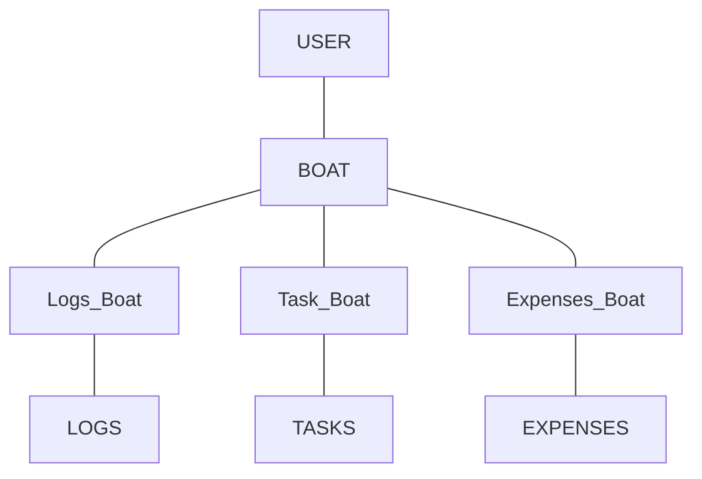
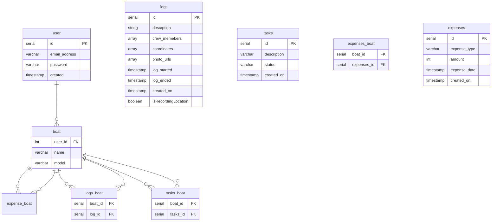

# BoatOwner

BoatOwner

## What is the purpose of the application?

Owning a boat can be quite challenging, requiring attention to numerous details ranging from maintenance and upkeep to managing finances and keeping track of all the small tasks that need to be completed throughout the year. Finding an effective way to organize and manage all this information can be daunting for any boat owner.

That's where BoatOwner comes in. BoatOwner is a versatile iOS/Android app designed specifically for boat owners to streamline the management of their vessels. This app offers a wide range of features that help users keep track of every aspect of boat ownership. With BoatOwner, users can log and monitor their expeditions and crossings, ensuring that every journey is recorded for future reference. The app also aids in planning and scheduling maintenance work, allowing boat owners to stay on top of necessary repairs and upkeep.

Additionally, BoatOwner includes robust financial tracking capabilities. Users can manage their expenses and keep detailed records of all costs associated with boat ownership, from fuel and docking fees to repairs and upgrades. This comprehensive financial oversight helps users budget more effectively and avoid unexpected expenses.

One of the standout features of BoatOwner is its ability to maintain a detailed log of all passages made during ownership. This log not only serves as a valuable record for the owner but also adds to the boat's documented history, which can be beneficial if the owner decides to sell the boat in the future.

In summary, BoatOwner is an essential tool for any boat owner looking to simplify and enhance their boating experience. It provides a centralized platform for managing all aspects of boat ownership, from tracking journeys and planning maintenance to monitoring finances and maintaining detailed logs. With BoatOwner, boat owners can enjoy their time on the water without the stress of juggling numerous responsibilities.

## Domain Model Diagram

## Entity Relationship Diagram

