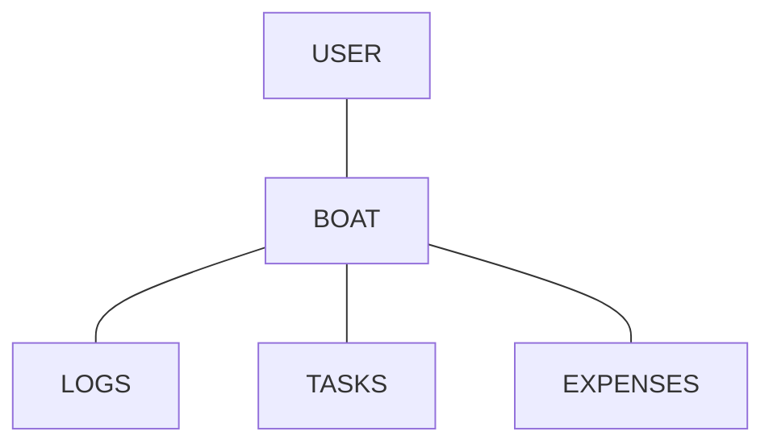
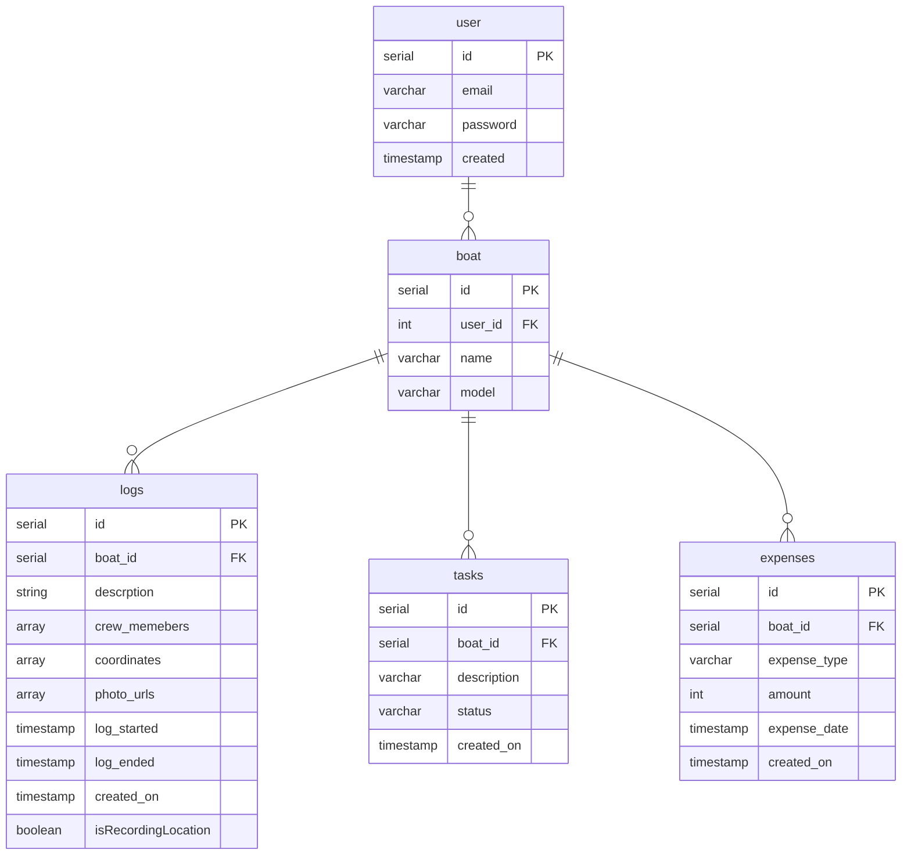

# BoatOwner

BoatOwner

## What is the purpose of the application?

Owning a boat can be quite challenging, requiring attention to numerous details ranging from maintenance and upkeep to managing finances and keeping track of all the small tasks that need to be completed throughout the year. Finding an effective way to organize and manage all this information can be daunting for any boat owner.

That's where BoatOwner comes in. BoatOwner is a versatile iOS/Android app designed specifically for boat owners to streamline the management of their vessels. This app offers a wide range of features that help users keep track of every aspect of boat ownership. With BoatOwner, users can log and monitor their expeditions and crossings, ensuring that every journey is recorded for future reference. The app also aids in planning and scheduling maintenance work, allowing boat owners to stay on top of necessary repairs and upkeep.

Additionally, BoatOwner includes robust financial tracking capabilities. Users can manage their expenses and keep detailed records of all costs associated with boat ownership, from fuel and docking fees to repairs and upgrades. This comprehensive financial oversight helps users budget more effectively and avoid unexpected expenses.

One of the standout features of BoatOwner is its ability to maintain a detailed log of all passages made during ownership. This log not only serves as a valuable record for the owner but also adds to the boat's documented history, which can be beneficial if the owner decides to sell the boat in the future.

In summary, BoatOwner is an essential tool for any boat owner looking to simplify and enhance their boating experience. It provides a centralized platform for managing all aspects of boat ownership, from tracking journeys and planning maintenance to monitoring finances and maintaining detailed logs. With BoatOwner, boat owners can enjoy their time on the water without the stress of juggling numerous responsibilities.

## MVP

- Ability for users to Log in / Log out and authenticate user accounts
- Ability for users to view expenses, logs and tasks in seperate tabs per boat
- Ability for users to add a new expense via expense tab
- Ability for users to add a new task via task tab
- Ability for users to begin a 'log session' where the co-ordinates of the journey undertaken while recorded can be saved to the db per log
- Ability for users to add a description, photos and any other information required to save a log after recording the journey
- Ability for users to view all expenses in a user friendly manner in the expenses tab
- Ability for users to view all past logs associated with their boat
- Ability for users to view, edit and update tasks associated with their boat

## Domain Model Diagram



## Entity Relationship Diagram



### API Specification

USER
GET /users

Return a list of all users

```[
{
"id": 1,
"email": "user1@email.com",
"user_name": "user1",
"created": "2024-01-01"
},
{
"id": 2,
"email": "user2@email.com",
"user_name": "user2",
"created": "2024-02-02"
}
]
```

Response: 200 Success

GET /users/{id}

Return a user

```
{
"id": 1,
"email": "user1@email.com",
"user_name": "user1",
"created": "2024-01-01"
}
```

Response: 200 Success
Response: 404 Not Found (if user with the given id does not exist)

POST /users

Create a user

```
{
"email": "newuser@email.com",
"password": "password123",
"created": "2023-08-05 10:00:00"
}
```

Response: 201 Created
Response: 400 Bad Request (if required fields are missing or invalid)

PUT /users/{id}

Update a user

```
{
"email": "newuser@email.com",
"password": "password123",
"created": "2023-08-05 10:00:00"
}
```

Response: 200 Success
Response: 400 Bad Request (if required fields are missing or invalid)
Response: 404 Not Found (if user with the given id does not exist)

DELETE /users/{id}

Deletes a user

```
{
}
```

Response: 204 No Content
Response: 404 Not Found (if user with the given id does not exist)

BOATS
GET /boats

Return a list of all boats

```
[
  {
    "id": 1,
    "user_id": 1,
    "name": "Boaty McBoatface",
    "model": "X200"
  },
  {
    "id": 2,
    "user_id": 2,
    "name": "Sea Explorer",
    "model": "Y100"
  }
]
```

Response: 200 Success

GET /boats/{id}

Return a boat

```
{
  "id": 1,
  "user_id": 1,
  "name": "Boaty McBoatface",
  "model": "X200"
}
```

Response: 200 Success
Response: 404 Not Found (if boat with the given id does not exist)

POST /boats

Create a boat

```
{
  "user_id": 1,
  "name": "New Boat",
  "model": "Z300"
}
```

Response: 201 Created
Response: 400 Bad Request (if required fields are missing or invalid)

PUT /boats/{id}

Update a boat

```
{
  "user_id": 1,
  "name": "Updated Boat",
  "model": "Z300"
}
```

Response: 200 Success
Response: 400 Bad Request (if required fields are missing or invalid)
Response: 404 Not Found (if boat with the given id does not exist)

DELETE /boats/{id}

Deletes a boat

```
{
}
```

Response: 204 No Content
Response: 404 Not Found (if boat with the given id does not exist)

LOGS
GET /logs

Return a list of all logs

```
[
  {
    "id": 1,
    "boat_id": 1,
    "description": "Departed from dock",
    "crew_members": ["Alice", "Bob"],
    "coordinates": [[37.7749, -122.4194], [36.7783, -119.4179]],
    "photo_urls": ["http://example.com/photo1.jpg", "http://example.com/photo2.jpg"],
    "log_started": "2023-07-01T08:00:00Z",
    "log_ended": "2023-07-01T12:00:00Z",
    "created_on": "2023-07-01T08:00:00Z",
    "isRecordingLocation": true
  },
  {
    "id": 2,
    "boat_id": 2,
    "description": "Fishing trip",
    "crew_members": ["Charlie", "Dave"],
    "coordinates": [[35.6895, 139.6917], [34.0522, -118.2437]],
    "photo_urls": ["http://example.com/photo3.jpg", "http://example.com/photo4.jpg"],
    "log_started": "2023-07-02T06:00:00Z",
    "log_ended": "2023-07-02T10:00:00Z",
    "created_on": "2023-07-02T06:00:00Z",
    "isRecordingLocation": false
  }
]
```

Response: 200 Success

GET /boat/logs/{boat_id}

```
Return all logs associated with a boat
{
  "id": 1,
  "boat_id": 1,
  "description": "Departed from dock",
  "crew_members": ["Alice", "Bob"],
  "coordinates": [[37.7749, -122.4194], [36.7783, -119.4179]],
  "photo_urls": ["http://example.com/photo1.jpg", "http://example.com/photo2.jpg"],
  "log_started": "2023-07-01T08:00:00Z",
  "log_ended": "2023-07-01T12:00:00Z",
  "created_on": "2023-07-01T08:00:00Z",
  "isRecordingLocation": true
}
```

Response: 200 Success
Response: 404 Not Found (if log with the given id does not exist)

GET /logs/{id}

```
Return a log
{
  "id": 1,
  "boat_id": 1,
  "description": "Departed from dock",
  "crew_members": ["Alice", "Bob"],
  "coordinates": [[37.7749, -122.4194], [36.7783, -119.4179]],
  "photo_urls": ["http://example.com/photo1.jpg", "http://example.com/photo2.jpg"],
  "log_started": "2023-07-01T08:00:00Z",
  "log_ended": "2023-07-01T12:00:00Z",
  "created_on": "2023-07-01T08:00:00Z",
  "isRecordingLocation": true
}
```

Response: 200 Success
Response: 404 Not Found (if log with the given id does not exist)

POST /logs/{boat_id}

Create a log

```

{
  "description": "New log entry",
  "crew_members": ["Eve", "Frank"],
  "coordinates": [[40.7128, -74.0060], [34.0522, -118.2437]],
  "photo_urls": ["http://example.com/photo5.jpg", "http://example.com/photo6.jpg"],
  "log_started": "2023-07-03T07:00:00Z",
  "log_ended": "2023-07-03T11:00:00Z",
  "created_on": "2023-07-03T07:00:00Z",
  "isRecordingLocation": true
}
```

Response: 201 Created
Response: 400 Bad Request (if required fields are missing or invalid)

PUT /logs/{id}

Update a log

```
{
  "boat_id": 1,
  "description": "Updated log entry",
  "crew_members": ["George", "Hannah"],
  "coordinates": [[41.8781, -87.6298], [34.0522, -118.2437]],
  "photo_urls": ["http://example.com/photo7.jpg", "http://example.com/photo8.jpg"],
  "log_started": "2023-07-04T08:00:00Z",
  "log_ended": "2023-07-04T12:00:00Z",
  "created_on": "2023-07-04T08:00:00Z",
  "isRecordingLocation": false
}
```

Response: 200 Success
Response: 400 Bad Request (if required fields are missing or invalid)
Response: 404 Not Found (if log with the given id does not exist)

POST Co-ordinates
Add a new co-ordinate to a log

```
{
  "log_id": 1,
  "coordinates": [[41.8781, -87.6298], [34.0522, -118.2437]],
  "isRecordingLocation": true
}
```

Response: 200 Success
Response: 400 Bad Request (if required fields are missing or invalid)
Response: 404 Not Found (if log with the given id does not exist)

DELETE /logs/{id}

Deletes a log

```
{
}
```

Response: 204 No Content
Response: 404 Not Found (if log with the given id does not exist)

TASKS
GET /tasks

Return a list of all tasks

```
[
  {
    "id": 1,
    "boat_id": 1,
    "description": "Clean the deck",
    "status": "Pending",
    "created_on": "2023-08-01T09:00:00Z"
  },
  {
    "id": 2,
    "boat_id": 2,
    "description": "Inspect the engine",
    "status": "Completed",
    "created_on": "2023-08-02T10:00:00Z"
  }
]
```

Response: 200 Success

GET /tasks/{id}

Return a task

```
{
  "id": 1,
  "boat_id": 1,
  "description": "Clean the deck",
  "status": "Pending",
  "created_on": "2023-08-01T09:00:00Z"
}
```

Response: 200 Success
Response: 404 Not Found (if task with the given id does not exist)

GET /boat/{boat_id}/tasks

Return all tasks associated with a boat

```
[
{
  "id": 1,
  "description": "Clean the deck",
  "status": "Pending",
  "created_on": "2023-08-01T09:00:00Z"
},
{
  "id": 2,
  "description": "Clean the wheel",
  "status": "Done",
  "created_on": "2023-08-01T09:00:00Z"
}
]
```

Response: 200 Success
Response: 404 Not Found (if boat id is not found)

POST /tasks/{boat_id}

Create a task

```
{
  "description": "Repair the sail",
  "status": "In Progress",
  "created_on": "2023-08-05T11:00:00Z"
}
```

Response: 201 Created
Response: 400 Bad Request (if required fields are missing or invalid)

PUT /tasks/{id}

Update a task

```
{
  "description": "Repair the sail",
  "status": "Completed"
}
```

Response: 200 Success
Response: 400 Bad Request (if required fields are missing or invalid)
Response: 404 Not Found (if task with the given id does not exist)

DELETE /tasks/{id}

Deletes a task

```
{
}
```

Response: 204 No Content
Response: 404 Not Found (if task with the given id does not exist)

EXPENSES
GET /expenses

Return a list of all expenses

```
[
{
"id": 1,
"boat_id": 1,
"expense_type": "Fuel",
"amount": 500,
"expense_date": "2023-08-01T09:00:00Z",
"created_on": "2023-08-01T09:00:00Z"
},
{
"id": 2,
"boat_id": 2,
"expense_type": "Maintenance",
"amount": 300,
"expense_date": "2023-08-02T10:00:00Z",
"created_on": "2023-08-02T10:00:00Z"
}
]
```

Response: 200 Success

GET /expenses/boat_id

Return a list of all expenses by boat_id

```
[
{
"id": 1,
"expense_type": "Fuel",
"amount": 500,
"expense_date": "2023-08-01T09:00:00Z",
"created_on": "2023-08-01T09:00:00Z"
},
{
"id": 2,
"expense_type": "Maintenance",
"amount": 300,
"expense_date": "2023-08-02T10:00:00Z",
"created_on": "2023-08-02T10:00:00Z"
}
]
```

Response: 200 Success

GET /expenses/{id}

Return an expense

```
{
  "id": 1,
  "boat_id": 1,
  "expense_type": "Fuel",
  "amount": 500,
  "expense_date": "2023-08-01T09:00:00Z",
  "created_on": "2023-08-01T09:00:00Z"
}
```

Response: 200 Success
Response: 404 Not Found (if expense with the given id does not exist)

GET boat/{boat_id}/expenses

Return an expense

```
[
{
  "id": 1,
  "boat_id": 1,
  "expense_type": "Fuel",
  "amount": 500,
  "expense_date": "2023-08-01T09:00:00Z",
  "created_on": "2023-08-01T09:00:00Z"
},
{
  "id": 1,
  "boat_id": 1,
  "expense_type": "Fuel",
  "amount": 500,
  "expense_date": "2023-08-01T09:00:00Z",
  "created_on": "2023-08-01T09:00:00Z"
}
]
```

Response: 200 Success
Response: 404 Not Found (if expense with the given id does not exist)

POST /expenses

Create an expense

```
{
  "boat_id": 1,
  "expense_type": "Supplies",
  "amount": 200,
  "expense_date": "2023-08-05T11:00:00Z",
  "created_on": "2023-08-05T11:00:00Z"
}
```

Response: 201 Created
Response: 400 Bad Request (if required fields are missing or invalid)

PUT /expenses/{id}

Update an expense

```
{
  "boat_id": 1,
  "expense_type": "Supplies",
  "amount": 250,
  "expense_date": "2023-08-05T11:00:00Z"
}
```

Response: 200 Success
Response: 400 Bad Request (if required fields are missing or invalid)
Response: 404 Not Found (if expense with the given id does not exist)

DELETE /expenses/{id}

Deletes an expense

```
{
}
```

Response: 204 No Content
Response: 404 Not Found (if expense with the given id does not exist)
