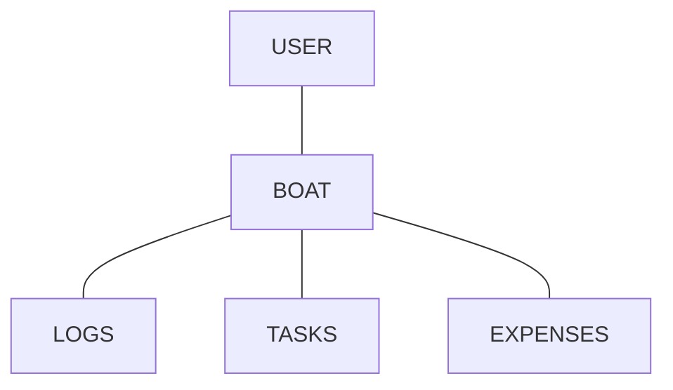
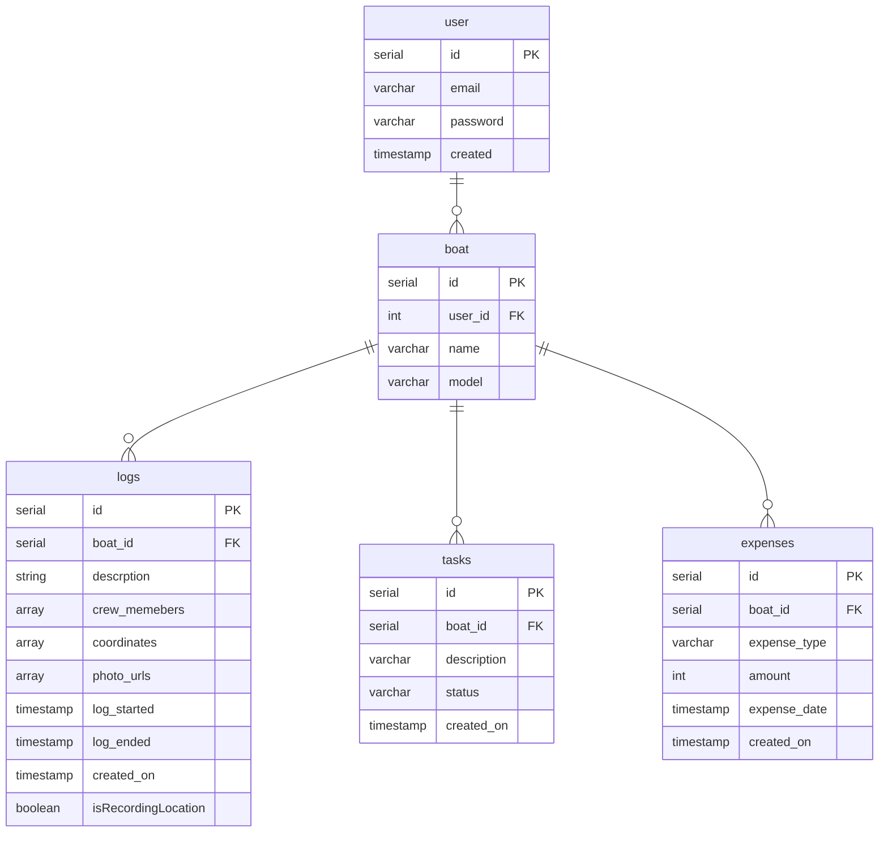
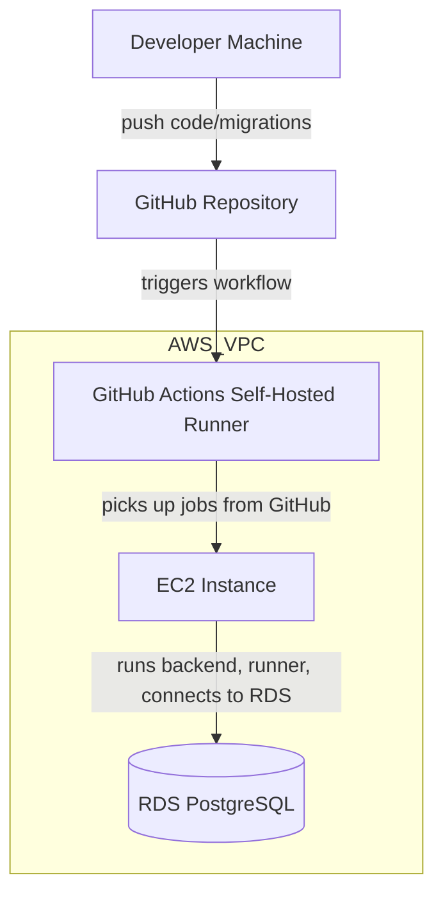

# BoatOwner

BoatOwner

## Trello board to track work

https://trello.com/b/7GH6OZzf/boatowner

---

## What is the purpose of the application?

Owning a boat can be quite challenging, requiring attention to numerous details ranging from maintenance and upkeep to managing finances and keeping track of all the small tasks that need to be completed throughout the year. Finding an effective way to organize and manage all this information can be daunting for any boat owner.

That's where BoatOwner comes in. BoatOwner is a versatile iOS/Android app designed specifically for boat owners to streamline the management of their vessels. This app offers a wide range of features that help users keep track of every aspect of boat ownership. With BoatOwner, users can log and monitor their expeditions and crossings, ensuring that every journey is recorded for future reference. The app also aids in planning and scheduling maintenance work, allowing boat owners to stay on top of necessary repairs and upkeep.

Additionally, BoatOwner includes robust financial tracking capabilities. Users can manage their expenses and keep detailed records of all costs associated with boat ownership, from fuel and docking fees to repairs and upgrades. This comprehensive financial oversight helps users budget more effectively and avoid unexpected expenses.

One of the standout features of BoatOwner is its ability to maintain a detailed log of all passages made during ownership. This log not only serves as a valuable record for the owner but also adds to the boat's documented history, which can be beneficial if the owner decides to sell the boat in the future.

In summary, BoatOwner is an essential tool for any boat owner looking to simplify and enhance their boating experience. It provides a centralized platform for managing all aspects of boat ownership, from tracking journeys and planning maintenance to monitoring finances and maintaining detailed logs. With BoatOwner, boat owners can enjoy their time on the water without the stress of juggling numerous responsibilities.

---

## MVP

- Ability for users to Log in / Log out and authenticate user accounts
- Ability for users to view expenses, logs and tasks in separate tabs per boat
- Ability for users to add a new expense via expense tab
- Ability for users to add a new task via task tab
- Ability for users to begin a 'log session' where the co-ordinates of the journey undertaken while recorded can be saved to the db per log
- Ability for users to add a description, photos and any other information required to save a log after recording the journey
- Ability for users to view all expenses in a user friendly manner in the expenses tab
- Ability for users to view all past logs associated with their boat
- Ability for users to view, edit and update tasks associated with their boat

---

## Domain Model Diagram


```mermaid
flowchart
 USER --- BOAT
 BOAT --- LOGS
 BOAT --- TASKS
 BOAT --- EXPENSES
```

---

## Entity Relationship Diagram


```mermaid
erDiagram
    user ||--o{ boat : ""
    boat ||--o{ logs : ""
    boat ||--o{ tasks : ""
    boat ||--o{ expenses : ""

 user {
    serial id PK
    varchar email
    varchar password
    timestamp created
}
 boat {
    serial id PK
    int user_id FK
    varchar name
    varchar model
}

logs {
    serial id PK
    serial boat_id FK
    string descrption
    array crew_memebers
    array coordinates
    array photo_urls
    timestamp log_started
    timestamp log_ended
    timestamp created_on
    boolean isRecordingLocation
}

tasks {
    serial id PK
    serial boat_id FK
    varchar description
    varchar status
    timestamp created_on
}

expenses {
    serial id PK
    serial boat_id FK
    varchar expense_type
    int amount
    timestamp expense_date
    timestamp created_on
}
```

---

## 🛠️ Getting Started (Frontend)

1. **Install dependencies**

   ```bash
   npm install
   ```

2. **Configure environment variables**

   Copy `.env.template` to `.env.local` or `.env.development` and fill in your values:

   ```
   EXPO_PUBLIC_IS_LOCAL_DEV=false
   EXPO_PUBLIC_API_BASE_URL=https://your-api-url
   GOOGLE_MAPS_API_KEY=your-google-maps-key
   ```

3. **Start the app**

   ```bash
   npx expo start
   ```

   You can then open the app in:

   - [Development build](https://docs.expo.dev/develop/development-builds/introduction/)
   - [Android emulator](https://docs.expo.dev/workflow/android-studio-emulator/)
   - [iOS simulator](https://docs.expo.dev/workflow/ios-simulator/)
   - [Expo Go](https://expo.dev/go)

---

## 🛠️ Getting Started (Backend)

1. **Install dependencies**

   ```bash
   cd server
   npm install
   ```

2. **Configure environment variables**

   Copy `server/.env.example` to `server/.env` and fill in your values:

   ```bash
   cp server/.env.example server/.env
   # Edit server/.env with your database URL, JWT secrets, etc.
   ```

3. **Choose your deployment method:**

   **Local Development (with local PostgreSQL):**
   ```bash
   # Start local database, run migrations, and API
   make start_local_backend
   
   # Or manually:
   docker compose --profile local up --build -d
   cd server && npm run start
   ```

   **Deployed Environment (with external database like RDS):**
   ```bash
   # Requires pre-built Docker image
   docker compose --profile deployed up -d
   
   # Or with Makefile:
   make start_deployed
   ```

4. **Environment Profiles:**
   - **`local`**: Uses local PostgreSQL database, builds API from source with hot reload
   - **`deployed`**: Uses pre-built Docker image, connects to external database (RDS)

5. **Database Migrations:**
   - Local: Automatically run by Flyway service
   - Deployed: Run separately via GitHub Actions or manual Flyway execution

---

## 🚀 Features

- **Modern authentication:** Secure sign-in and sign-up with access/refresh token flow, automatic token refresh, and protected routes.
- **Production-ready UI:** Clean, branded sign-in and sign-up screens with Expo vector icon logo and social login placeholders.
- **API integration:** All API requests use `authFetch` for automatic access token handling and refresh.
- **Task, Log, and Expense management:** Create, update, and delete tasks, logs, and expenses for your boat.
- **TypeScript-first:** Strong typing across all code.
- **React Query:** For data fetching and caching.
- **File-based routing:** Powered by Expo Router.

---

## 🧑‍💻 Development Notes

- **Authentication:**  
  All API calls use `authFetch`, which attaches the access token, refreshes it if expired, and redirects to sign-in if both tokens are invalid. The backend exposes a `/users/token` endpoint for refreshing tokens.
- **UI:**  
  The sign-in and sign-up screens use a ship icon from Expo vector icons as the logo. Social login buttons for Apple and Google are present as placeholders.
- **API:**  
  All fetch files (`todo.fetch.ts`, `expenses.fetch.ts`, `logs.fetch.ts`, etc.) use `authFetch` for secure requests. The backend protects all routes except `/health` with authentication middleware.
- **Testing:**  
  Run tests with:

  ```bash
  npm test
  ```

- **Routing:**  
  Uses Expo Router for file-based navigation.

---

## 📁 Project Structure

- `app/` - App screens and routing
- `api/` - API fetch utilities (uses `authFetch`)
- `components/` - Reusable UI components
- `constants/` - App-wide constants
- `context/` - React context (e.g., Auth)
- `hooks/` - Custom React hooks
- `interfaces/` - TypeScript interfaces
- `utils/` - Utility functions
- `assets/` - Images and icons

---

## 🖥️ Development Server & AWS Setup Summary

### Backend Dev Server on AWS (EC2 + RDS + Self-Hosted Runner)

1. **AWS EC2 Instance**
   - Provision an Ubuntu EC2 instance in your AWS account.
   - Attach a security group allowing SSH (port 22) from your IP and API port (e.g., 4000) as needed.
   - Use a key pair for SSH access (`.pem` file).

2. **AWS RDS (PostgreSQL) Database**
   - Create an RDS PostgreSQL instance in the same VPC as your EC2.
   - Set "Publicly Accessible" to No for security (recommended for production).
   - Attach a security group allowing inbound PostgreSQL (TCP 5432) from your EC2's security group.

3. **Self-Hosted GitHub Actions Runner**
   - SSH into your EC2 instance and set up the runner:
     ```zsh
     cd actions-runner/
     ./run.sh
     ```
   - The runner will now pick up jobs from your repo and run them inside your VPC.

4. **Checking DB Connectivity from EC2**
   - Test DNS resolution:
     ```zsh
     nslookup <rds-endpoint>
     ```
   - Test network connectivity:
     ```zsh
     telnet <rds-endpoint> 5432
     ```
   - Test PostgreSQL connection:
     ```zsh
     psql -h <rds-endpoint> -U <username> -d <dbname> -p 5432
     ```
   - If you see the `boatowner=>` prompt, connection is successful.

5. **Connect to EC2 instance**
   - To connect to DEV EC2, use the following command ```ssh -i Desktop/boatownerec2key.pem ubuntu@3.255.10.141z```

5. **Typical Workflow**
   - Push code/migrations to GitHub.
   - Self-hosted runner on EC2 picks up the job, runs migrations/deployments, and connects to RDS securely.

---

## 🗺️ Dev Architecture Diagram


```mermaid
graph TD
    subgraph AWS_VPC
        EC2[EC2 Instance]
        RDS[(RDS PostgreSQL)]
        Runner[GitHub Actions Self-Hosted Runner]
        EC2 -- runs backend, runner, connects to RDS --> RDS
        Runner -- picks up jobs from GitHub --> EC2
    end
    GitHub[GitHub Repository]
    DevMachine[Developer Machine]
    DevMachine -- push code/migrations --> GitHub
    GitHub -- triggers workflow --> Runner
```

**Legend:**
- EC2: Ubuntu instance running backend and self-hosted runner
- RDS: PostgreSQL database
- Runner: GitHub Actions self-hosted runner (on EC2)
- GitHub: Source code and workflow triggers
- DevMachine: Your local development machine

---

## 🚀 Deployment Process (Environment-Specific)

### Environment-Specific Docker Compose Strategy

The deployment pipeline uses separate Docker Compose files and environment configurations for each deployment target:

#### **Architecture Benefits:**
1. **Clear Separation**: Each environment has dedicated configuration files
2. **Environment-Specific Settings**: Unique database credentials and secrets per environment
3. **Security**: Production secrets isolated from development
4. **Scalability**: Easy to add new environments (staging, qa, demo)

#### **File Structure:**
```
├── docker-compose.yml          # Local development only
├── docker-compose.dev.yml      # Development environment deployment
├── docker-compose.staging.yml  # Staging environment deployment  
├── docker-compose.prod.yml     # Production environment deployment
└── server/
    ├── .env.local              # Local development
    ├── .env.dev                # Development environment
    ├── .env.staging            # Staging environment
    └── .env.prod               # Production environment
```

#### **Current Deployment Flow (DEV):**
1. **Code Push**: Push to `develop` branch triggers deployment
2. **Docker Build**: API built as Docker image on self-hosted runner
3. **File Upload**: SCP operations upload:
   - Docker image tar file to `~/boatowner-api.tar`
   - Development environment file (`server/.env.dev`)
   - Development compose file (`docker-compose.dev.yml`)
4. **Deployment**: SSH script loads Docker image and starts services using dev-specific files

#### **Environment Commands:**
```bash
# Local development
docker compose up -d

# Development deployment  
docker compose -f docker-compose.dev.yml up -d

# Staging deployment (future)
docker compose -f docker-compose.staging.yml up -d

# Production deployment (future)
docker compose -f docker-compose.prod.yml up -d
```

#### **Database Configuration (DEV):**
- **Database Name**: `boatowner_dev`
- **Database User**: `boatowner_dev_user`
- **Database Host**: AWS RDS (eu-west-1)
- **Environment**: Development with proper isolation

#### **Key Files:**
- `.github/workflows/deploy_api.yml` - Development deployment workflow
- `docker-compose.dev.yml` - Development environment Docker Compose
- `server/.env.dev` - Development environment variables
- `ENVIRONMENT_DEPLOYMENT_SETUP.md` - Comprehensive environment setup guide

#### **Troubleshooting:**
If deployment fails, check:
1. **GitHub Actions logs** for specific error messages
2. **Environment file** (`.env.dev`) has correct database credentials
3. **Docker Compose file** (`docker-compose.dev.yml`) references correct environment
4. **EC2 security groups** allow SSH and required ports
5. **RDS connectivity** from EC2 instance using dev database credentials

For detailed troubleshooting steps, see `DEPLOYMENT_TROUBLESHOOTING.md`.

---

## 📝 Learn More

- [Expo documentation](https://docs.expo.dev/)
- [Expo Router](https://docs.expo.dev/router/introduction/)
- [React Native](https://reactnative.dev/)

---

## 💬 Community

- [Expo on GitHub](https://github.com/expo/expo)
- [Expo Discord](https://chat.expo.dev)

---

## ⚓️ BoatOwner

Built with ❤️ for boat owners.

---
